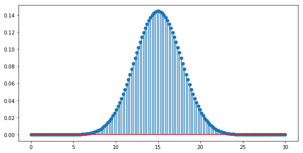
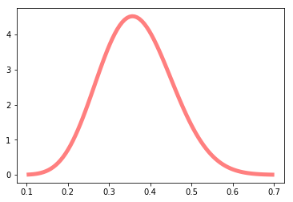

# Discrete Probability Distributions
Ref: https://www.countbayesie.com/blog/2015/3/17/interrogating-probability-distributions

Equation to obtain the discrete probability (dp) of having n values in k attempts

$dp$ $=$ $\binom{n}{k}$ $p^k(1-p)^{n-k}$


```python
import math
import scipy

import matplotlib.pyplot as plt
import numpy as np
from matplotlib import colors
from scipy import integrate
from scipy.stats import beta
```


```python
def scipyFactorial(k, n):
    return scipy.special.binom(k, n)

def probabilityMassFunction(n, k, p):
    heads = scipyFactorial(k,n)
    tails = math.pow(p, n) * math.pow(1-p, k-n)
    return heads * tails

n=10
k=30
p=0.5
print("Probability of having {} tails is {:0.3f}".format(n, probabilityMassFunction(n,k,p)))

# x = [i for i in range(k)]
x = np.linspace(0, k, 30*5)
y = [probabilityMassFunction(i,k,p) for i in x]

plt.figure(figsize=(10,5))
plt.stem(x, y, use_line_collection=True)
plt.show()
```

    Probability of having 10 tails is 0.028





```python
first = 18
last = 25

def probabilityMassFunctionRange(first, last, k, p):
    values = [x for x in range(first,last, 1)]
    total = 0
    for i in values:
        total += probabilityMassFunction(i,k,p)
    return total

print("Probability of having between {} and {} tails (inclusive) is {:0.3f}".format(first, last, probabilityMassFunctionRange(first, last, k, p)))
```

    Probability of having between 18 and 25 tails (inclusive) is 0.181


# Beta

$Beta$($\alpha$,$\beta$) = $\frac{x^{\alpha - 1}(1-x)^{\beta -1}}{B(\alpha ,\beta)}$


```python
a, b = 11, 19
mean, var, skew, kurt = beta.stats(a, b, moments='mvsk')
print("mean: {}, variance: {}, skew: {}, kurt: {}".format(mean, var, skew, kurt))

x = np.linspace(beta.ppf(0.0001, a, b),
                beta.ppf(0.9999, a, b), 100)

plt.plot(x, beta.pdf(x, a, b),
       'r-', lw=5, alpha=0.5, label='beta pdf')
```

    mean: 0.36666666666666664, variance: 0.007491039426523298, skew: 0.19256515705838026, kurt: -0.12788168769030014


    [<matplotlib.lines.Line2D at 0x10eaa0630>]





## "What is the probability that ppp is between 0.2 and 0.5?"


```python
minimum = 0.2
maximum = 0.5

ii = integrate.quad(beta.pdf, minimum, maximum, args=((a, b)))

print("What is the probability that p is between {} and {}?: {:0.3f}".format(minimum, maximum, ii[0]))
```

    What is the probability that p is between 0.2 and 0.5?: 0.912


# Logistic Regression from Bayes' Theorem

Reference: https://www.countbayesie.com/blog/2019/6/12/logistic-regression-from-bayes-theorem

Calculate the odds between two hypothesis

O(H|D) = $\frac{P(D|H)}{P(D|\bar{H})}O(H)$

But this is not good to fit into a linear equation:

y = $\beta x+ \beta_0$


For this, we can use the Log function

$ln(O(H|D))$ = $ln(\frac{P(D|H)}{P(D|\bar{H})}O(H))$ = $ln(\frac{P(D|H)}{P(D|\bar{H})}) + ln(O(H))$

What we need is really just that:

$\beta_0 = ln(O(H))$

Or that $\beta_0$ is the log of the prior odds. 

To make it fit with what we need:

$lo(H|D) = \beta D + \beta_0$

but because 1/0 is undefined, and ln(0) is also undefined, we need to modify the equation to handle these values on the right side

$P(H|D) = \frac{1}{1+e^{-(\beta D + \beta_0)}}$

Where 

* $\beta D$ is $ln(\frac{P(D|H)}{P(D|\bar{H})})$ 

* Our prior odds, $\beta_0$ is $ln(O(H))$, or $ln(\frac{P(H)}{P(\bar{H})})$


\frac{P(H|D)}{P(\bar{H}|D)} = \frac{P(D|H)P(H)}{P(D|\bar{H})P(\bar{H})}


```python
ph = 3
pnh = 1

d = 30
h = 1

b0, var, skew, kurt = beta.stats(ph, pnh, moments='mvsk')
print("b0 (prior that the coffee will be good): {}".format(b0)) # b0 = ln(p(h)/p(!h))

bD, var, skew, kurt = beta.stats(d, h, moments='mvsk')
print("bD (probability of the data given the hypothesis): {}".format(bD))

lo = math.exp(bD) + math.exp(b0)
print("lo(H|D) = bD + b0 = {}".format(bD, b0, lo))

print("Probability of the Hypothesis given the data")
print("P(H|D) = {}".format((1/(1+math.exp(-(lo))))))
```

    b0 (prior that the coffee will be good): 0.75
    bD (probability of the data given the hypothesis): 0.967741935483871
    lo(H|D) = bD + b0 = 0.967741935483871
    Probability of the Hypothesis given the data
    P(H|D) = 0.9914139600794254

